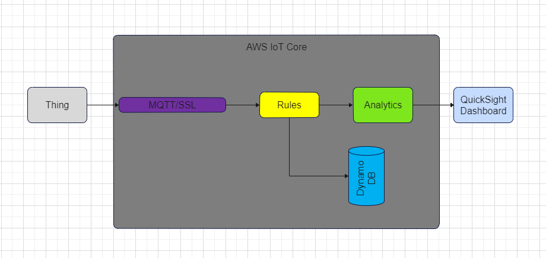
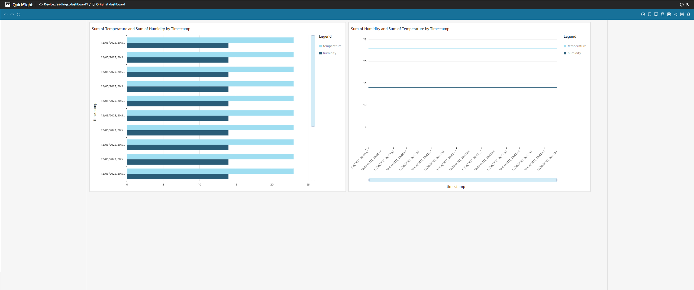

# Indoor Plant Care

## Overview
The Indoor Plant Care project aims to utilize temperature and humidity data for maintaining optimal indoor plant conditions.

## Hardware and Software Setup
The project involves an Arduino Uno connected to a DHT11 sensor, communicating data via serial communication to a Rock Pi 4 SE running a Python script sending data every 5 seconds. The AWS IoT ecosystem, comprising MQTT Broker, Rules Engine, IAM Roles, DynamoDB, IoT Analytics, and QuickSight forms the cloud infrastructure.

## Architecture

## Data Flow and Analysis
Sensor data collected by the Arduino is transmitted to the Rock Pi 4 SE, published to specific MQTT topics, processed through AWS IoT Rules, and stored in DynamoDB. IoT Analytics can further analyze this data to derive insights for better decisions or visualization.

## Visualization
The data from IoT Analytics data set is used creating a dashboard in QuickSight and can display graphs for the different readings like temperature and humidity for the indoor climate.

## Storage
The setup only uses dynamoDB for storing data and it is used for long-term storage. The data is otherwise funneled via IoT Analytics to QuickSight for visualization.

## Security
Using certificate-based authentication with private and public keys for device-to-cloud communication, each device has a unique certificate and private key, ensuring authorized and encrypted connections to AWS IoT. Additionally, IAM roles enforce strict access control, granting devices minimal privileges to AWS resources where applicable.

## Security considerations
Using arduino paired with the rock pi 4 se could potentially pose security vulnerabilities and could also pose a challenge while scaling trying to maintain secure communication across devices. The use of multiple controllers also makes it harder to properly secure the device due to the broader scope of flaws.
Keeping all the keys and certificates in a visible folder with full read/write rights on the device is not ideal either.
Adaptation of network segmentation could be a consideration to seperate IoT devices from the rest of the network to isolate any device-based breaches. Firewalls and port triggers could further limit the access for communication back to the device.

## Scalability
The architecture composed of Arduino Uno, DHT11 sensor, and the Rock Pi 4 SE might not be a well suited setup for scaling due to the vast processing power for such small computations. Using other microcontrollers with capabilities to directly communicate with AWS would be better suited for scaling to multiple devices and also automating the setup processes would help with that. In the current form every single device need to be manually configured and integrated with AWS.

## Dashboard

